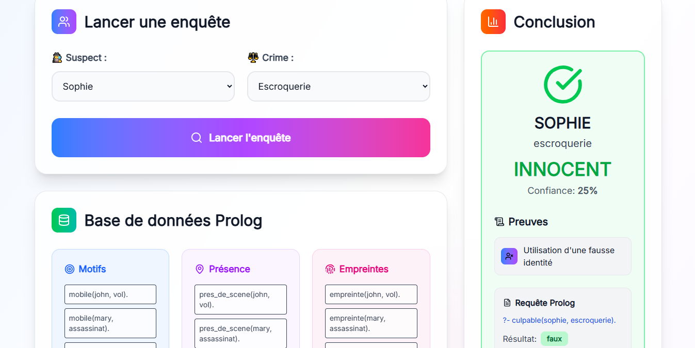

# Projet IA : Enquête Criminelle Logique (Prolog & React)

Ce projet est une application web interactive qui simule une enquête criminelle.  
Il combine un moteur de raisonnement logique en **SWI-Prolog** avec une interface utilisateur moderne et réactive développée en **React + Vite**.

L'objectif est de vous immerger dans un scénario d'enquête où la logique et les faits sont vos meilleurs outils.  
Le frontend communique avec une **API RESTful** exposée par Prolog, vous permettant d'interroger la base de connaissances et de découvrir la vérité.

---

## Fonctionnalités

- **Logique d’investigation** :  
  Le backend, implémenté en Prolog, gère la base de faits et les règles de raisonnement pour identifier les suspects.

- **Interface utilisateur** :  
  Le frontend React offre une expérience fluide et intuitive pour soumettre des requêtes et analyser les résultats.

---

## Capture d'écran

### Interface principale


Interface de l'application avec les sélecteurs de suspects et de crimes.

---

## Installation

Suivez les étapes ci-dessous pour lancer l'application sur votre machine.

### Cloner le dépôt

```bash
    git clone https://github.com/andry-brondone/projet-IA-prolog-react.git
```

### Backend Prolog

1. Installer SWI-Prolog :

```bash
    https://www.swi-prolog.org/Download.html
```

2. Se placer dans le dossier `projet-IA-prolog-react/prolog` et lancer le :

```bash
    cd projet-IA-prolog-react/prolog/
    swipl enquete.pl
```

### Frontend React

> Info : Dans une autre Terminale.

1. Installer les dépendances :

```bash
    cd projet-IA-prolog-react/
    npm install -g pnpm
    pnpm install
```

2. Démarrer le serveur de développement :

```bash
    pnpm dev
```

## Accès local

- Frontend : http://localhost:5173
- Backend API : http://localhost:8080
